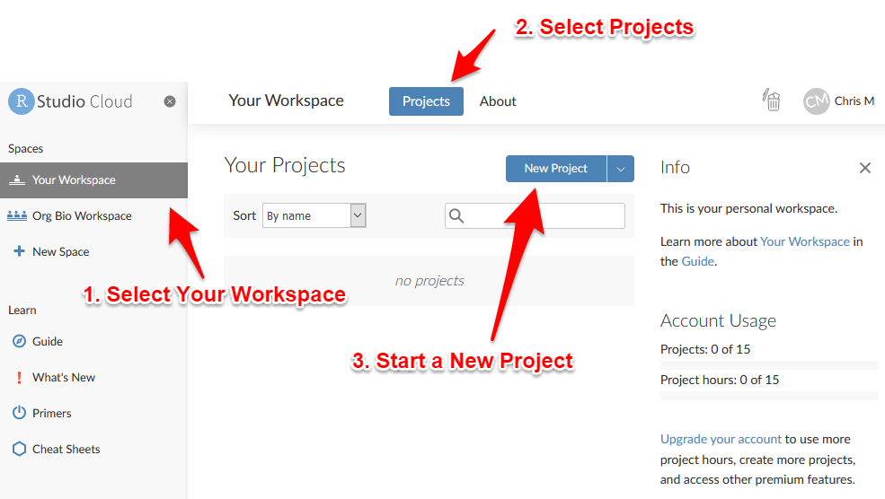

# Create A Project

## What are Projects?

RStudio projects make it straightforward to divide your work into multiple contexts, each with their own working directory, workspace, history, and source documents (scripts), and data files.


## Create a Project in RStudio Cloud

Go to [Rstudio Cloud](https://rstudio.cloud/) and sign in.

To create a new project:

1. Go to Your Workspace
2. Go to the Projects tab
2. Click the button to start a New Project and select "New RStudio Project"



Wait a moment while your new project is deployed.

When the screen refreshes you will have a new, empty project.

You can give your project a name by clicking on the words "Untitled Project" at the top of the window.

## The RStudio IDE

When you first open a project, you will see a window with three panes, the left pane will be on a tab named **Console**, the upper right pane will be on a tab named **Environment**, and the bottom right pane will be on a tab named **Files**, like this:


## The Console tab

The Console is where you enter commands (code) for R to interpret.

To give it a try, place your cursor in the Console window by clicking in it. You should see a greater than sign `>` (called the "prompt") with a blinking cursor next to it.

Type a double quote, the words "Hello World!", and another double quote, like this:

    `"Hello World"`

Now press the enter key to run the code. Under the code you ran will appear the output, which will look like this:

    `[1] "Hello World!"`

<p class="text-success font-weight-bold">Congratulations, you just wrote your first computer program!</p>

Now try another one. Type this code and press enter:

    `1+1`

The output should look like:

    `[1] 2`

Pressing enter is like asking R a question. R will evaluate the code you typed (yes, it's really computer code!) and print the output, which is the answer to your question.

In the second example, your question was `1+1` and the answer was `2`.

The number in square brackets, `[1]`, indicates that the answer had one part. You can pretty much ignore the brackets for now.

For the rest of this tutorial, we will use the following notation to indicate code that you should type into the console, and what the output should look like:


```r
2+2
```

```
#> [1] 4
```

The first box indicates the code you should run. Note that we do not show the `>` prompt, although you will see it in your console. Also note the clipboard icon on the right side of the box. You can click it to copy the code and then paste it into the console. This can save a lot of time with complex code.

The second box indicates the output you should see after you run the code. We add the symbols  to indicate lines of output, but output in your console will not have those symbols.

<span class="label label-info">Tip</span> If you ever try to type something in the console and nothing happens, it may be because some other pane has RStudio's attention. Click the Console pane and make sure the blinking cursor is showing.
