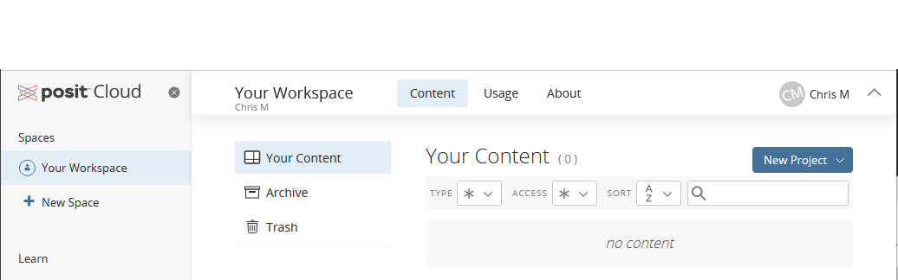

# (PART) Getting Started {-}

# About R and RStudio

**R** is a programming language and free software environment for statistical computing and graphics supported by the R Foundation for Statistical Computing. Today, R is the most commonly used software for data analysis in the biological sciences.

While it is possible to run R by itself, it is more common to run it as part of **RStudio**, a free and open-source integrated development environment (IDE) for R. For most uses, it's best to use RStudio rather than R directly. 

RStudio recently changed its name to Posit, so you may see either name in various places.

## Desktop vs. Cloud

RStudio/Posit has a variety of products to suit different needs. 

In this lab activity, you will use **[Posit Cloud](https://posit.cloud/)**. Directions for setting up your free account are in the following section.

The other option commonly used by scientists for graphing, data analysis, and communication is the free desktop version, RStudio Desktop. While not necessary for this course, if you are interested you can learn how to download, install, and set up the desktop version on the [course website for BIOL 275 Quantitative Biology](https://biol275-msum.github.io/install-r-and-rstudio.html).

## Posit Cloud Setup

### Sign up

First, create your free Posit Cloud account:

1. Go to https://posit.cloud/ 
2. Click "Get Started" or "Sign Up"
3. Select the default "Cloud Free" plan (click "Cloud Free" or "Learn More")
4. Click the "Sign up" button
5. Use an email address and password of your choice (they do not have to be your MSUM ones). You will have to confirm your email address after registering. To do so, go to your email account, find the message from Posit Cloud, and click the link to confirm the email address is yours.

After creating your account, you will be redirected to the Posit Cloud home page. If you are not, just go to https://posit.cloud/ and make sure you are signed in.

### Your Workspace

On the left, you will see a navigation pane with headings for Spaces, Learn, Help, and Info. When you start out, you will have only one Space, named **Your Workspace**. This is where projects you create will be listed. 

Note: if your browser window is small, the navigation pane may be hidden. Click the button that looks like three horizontal lines to show the menu.

The main window lists the projects in the currently selected workspace. When you first get started, it will say "*no projects*".

