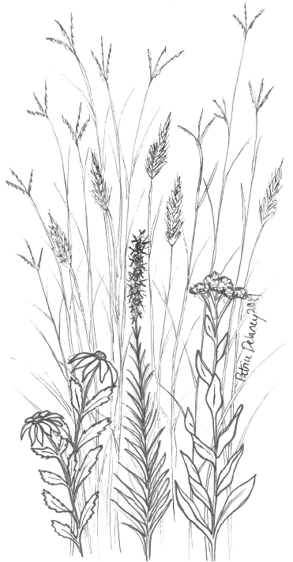

--- 
knit: "bookdown::render_book"
title: "Organismal Biology: Companion Website to BIOL 115 @ MSUM"
author: "Chris Merkord and Alison Wallace"
date: "2023-09-06"
github-repo: BIOL115-MSUM/BIOL115-MSUM.github.io
description: "A beginners guide to data analysis in R focused on comparing phenotypic variation in biological populations. Developed for the course BIOL 115L Organismal Biology Lab at Minnesota State University by Chris Merkord and Alison Wallace, with contributions from Katie Olson and others."
site: bookdown::bookdown_site
documentclass: book
---

# Welcome {-}

Welcome to the companion website for Organismal Biology (BIOL 115 and 115L) at Minnesota State University Moorhead. The site serves primarily as a beginners guide to data analysis in R. In this activity students learn to use R and RStudio to compare phenotypic variation in biological populations.

<figure class="figure text-right">
  
  <figcaption class="figure-caption text-right">Illustration by Patrice Delaney.</figcaption>
</figure>

These activities were developed by Chris Merkord and Alison Wallace, with contributions from Katie Olson and others.

In this lab you will learn how to view, summarize, and graph data.

Parts 1 to 3 of this lab will teach you how to use R and RStudio. Part 4 contains the instructions for the assignment you will turn in for your grade.

- In Part 1 of this lab, you will learn what R and RStudio are, how the RStudio environment is organized, and how RStudio organizes your work into Projects. To finish, you will create your first RStudio Project, which you will continue to work in for the rest of the lab. 
- In Part 2 of this lab, you will learn how to use the Console Window to run commands as you perform basic arithmetic operations. You will learn the basics of using functions, and finally learn
about creating objects using the assignment operator. 
- In Part 3 of this lab, you will be introduced to R scripts. You will use the Finches dataset to learn
how to read a tabular dataset into R, inspect it, and perform basic statistical summaries on it. You will estimate means, standard deviations, standard errors of the mean, and confidence intervals around the mean. You will also learn how to plot histograms and bar charts. 
- In Part 4, you will apply what you have learned to the grass data you collected at the Regional Science Center. You will create a new R script, read the grass data into R, plot histograms of plant height and rame length, estimate the means of those variables, and plot them on bar charts.

## Acknowledgements {-}

This website is hosted by GitHub Pages.
